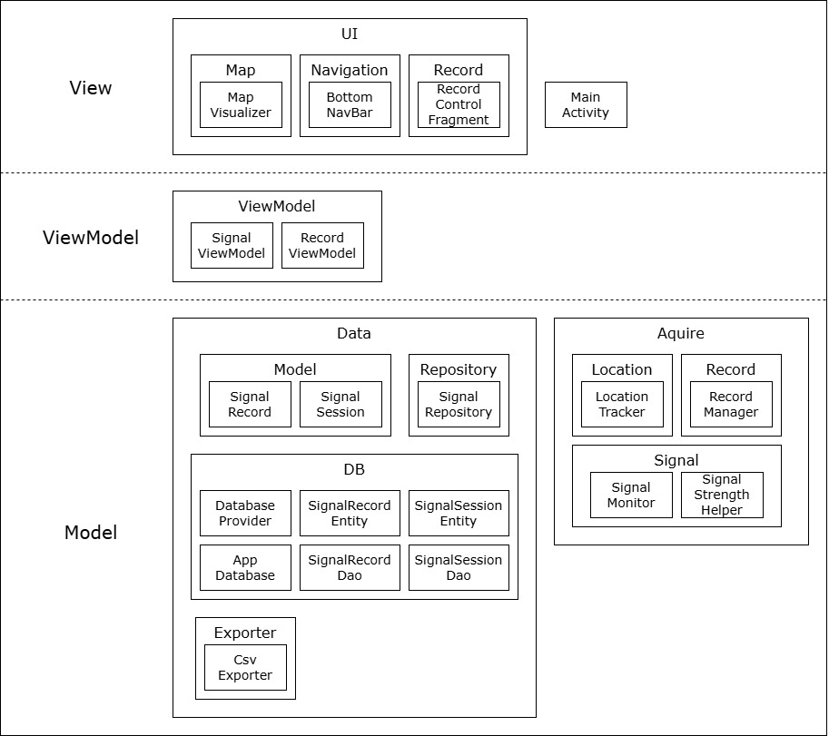

# RsrpAnalyzer

RsrpAnalyzer

## Summary

## Project Structure

```text
rsrpanalyzer/
├── MainActivity.kt
├── acquire/
│   ├── location/
│   │   └── LocationTracker.kt
│   └── signal
│       ├── SignalMonitor.kt
│       └── SignalStrengthHelper.kt
├── data/
│   ├── db/
│   │   ├── AppDatabase.kt
│   │   ├── SignalEntity.kt
│   │   └── SignalRecordDao.kt
│   ├── exporter/
│   │   └── CsvExporter.kt
│   ├── model/
│   │   └── SignalRecord.kt
│   └── repository/
│       └── SignalRepository.kt
├── ui/
│   ├── map/
│   │   └── MapVisualizer.kt
│   ├── navigation/
│   │   └── BottomNavBar.kt
│   └── record/
│       ├── RecordControlFragment.kt
│       └── RecordManager.kt
└── viewmodel/
    └── MainViewModel.kt
```

## Project Architecture



## UI Design

[//]: # (Add UI Design)

## Database Schema

[//]: # (Add SQLite Data Structure)

## CSV Format

[//]: # (Add CSV Format Exmaples)

## Usage

[//]: # (Add App Usage Examples)
