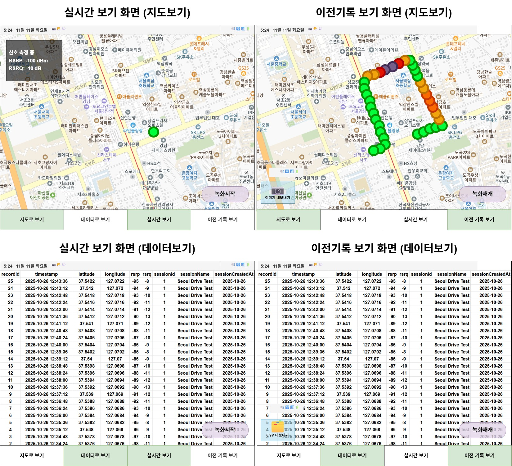

# RsrpAnalyzer

- [RsrpAnalyzer](#rsrpanalyzer)
    - [Key Dependencies](#key-dependencies)
  - [Summary](#summary)
    - [주요 기능](#주요-기능)
  - [Project Structure](#project-structure)
  - [Project Architecture](#project-architecture)
  - [UI Design](#ui-design)
  - [Database Schema](#database-schema)
    - [signal\_sessions](#signal_sessions)
    - [signal\_records](#signal_records)
    - [SQL](#sql)
  - [CSV Format](#csv-format)
    - [schema](#schema)
    - [example](#example)
  - [Usage](#usage)
    - [실시간 모니터링](#실시간-모니터링)
    - [RSRP/RSRQ 측정 세션](#rsrprsrq-측정-세션)
    - [시각화 사진 내보내기](#시각화-사진-내보내기)
    - [CSV 데이터 내보내기](#csv-데이터-내보내기)

---

**Android LTE Signal Strength Analyzer**

- **Language**: Kotlin 2.0.21
- **Build Tool**: Gradle 8.10.2 with Kotlin DSL
- **Min SDK**: 24 (Android 7.0 Nougat)
- **Target SDK**: 36 (Android 15)
- **Compile SDK**: 36
- **Architecture**: MVVM (Model-View-ViewModel)
- **JVM Target**: 11

### Key Dependencies

- **Room Database**: 2.6.1 - Local SQLite data persistence with KSP
- **Kakao Maps SDK**: 2.11.0 - Map visualization
- **Google Play Services Location**: 21.3.0 - GPS tracking and fused location

## Summary

RsrpAnalyzer는 실시간으로 LTE 신호 강도(RSRP)와 품질(RSRQ)을 측정하고 분석하는 Android 애플리케이션입니다.

### 주요 기능

1. **실시간 신호 모니터링**
    - LTE RSRP(Reference Signal Received Power) 측정
    - RSRQ(Reference Signal Received Quality) 측정
    - 신호 강도 변화 실시간 추적

2. **위치 기반 기록**
    - GPS를 활용한 정확한 위치 정보 수집
    - 신호 강도와 위치 정보 동시 저장
    - 이동 경로별 신호 세기 분석

3. **세션 관리**
    - 여러 측정 세션 생성 및 관리
    - 세션별 데이터 독립 저장
    - 세션 간 비교 분석 가능

4. **지도 시각화**
    - Kakao Map을 이용한 측정 위치 표시
    - 신호 강도에 따른 색상 구분
    - 측정 경로 시각화

5. **데이터 내보내기**
    - CSV 형식으로 데이터 추출
    - 세션별 또는 전체 데이터 내보내기
    - 외부 분석 도구와 연동 가능

## Project Structure

```text
rsrpanalyzer/
├── MainActivity.kt
├── data
│   ├── db
│   │   ├── AppDatabase.kt
│   │   ├── DatabaseProvider.kt
│   │   ├── SignalRecordDao.kt
│   │   ├── SignalRecordEntity.kt
│   │   ├── SignalSessionDao.kt
│   │   └── SignalSessionEntity.kt
│   ├── exporter
│   │   └── CsvExporter.kt
│   ├── model
│   │   ├── SignalRecord.kt
│   │   └── SignalSession.kt
│   └── repository
│       └── SignalRepository.kt
├── model
│   ├── location
│   │   └── LocationTracker.kt
│   ├── record
│   │   └── RecordManager.kt
│   └── signal
│       ├── SignalMonitor.kt
│       └── SignalStrengthHelper.kt
├── view
│   ├── map
│   │   └── MapVisualizer.kt
│   ├── navigation
│   │   └── BottomNavBar.kt
│   └── record
│       └── RecordControlFragment.kt
└── viewmodel
    ├── RecordViewModel.kt
    └── SignalViewModel.kt
```

## Project Architecture


## UI Design



## Database Schema

### signal_sessions

| 컬럼 이름       | 타입      | 제약 조건                     | 설명                      |
|-------------|---------|---------------------------|-------------------------|
| id          | INTEGER | PRIMARY KEY AUTOINCREMENT | 세션 고유 ID                |
| sessionName | TEXT    | NOT NULL, UNIQUE          | 세션 이름 (고유값)             |
| createdAt   | INTEGER | NOT NULL                  | 세션 생성 시각 (epoch millis) |

### signal_records

| 컬럼 이름           | 타입      | 제약 조건                                       | 설명                                |
|-----------------|---------|---------------------------------------------|-----------------------------------|
| id              | INTEGER | PRIMARY KEY AUTOINCREMENT                   | 레코드 고유 ID                         |
| sessionId       | INTEGER | NOT NULL, FOREIGN KEY → signal_sessions(id) | 연결된 세션 ID                         |
| timestampMillis | INTEGER | NOT NULL                                    | 기록 시각 (epoch millis)              |
| latitude        | REAL    | NOT NULL                                    | 위도                                |
| longitude       | REAL    | NOT NULL                                    | 경도                                |
| rsrp            | INTEGER | NOT NULL                                    | Reference Signal Received Power   |
| rsrq            | INTEGER | NOT NULL                                    | Reference Signal Received Quality |

### SQL

```roomsql
-- signal_sessions 테이블 생성
CREATE TABLE IF NOT EXISTS signal_sessions (
    id INTEGER PRIMARY KEY AUTOINCREMENT NOT NULL,
    sessionName TEXT NOT NULL UNIQUE,
    createdAt INTEGER NOT NULL
);
```

```roomsql
-- signal_records 테이블 생성
CREATE TABLE IF NOT EXISTS signal_records (
    id INTEGER PRIMARY KEY AUTOINCREMENT NOT NULL,
    sessionId INTEGER NOT NULL,
    timestampMillis INTEGER NOT NULL,
    latitude REAL NOT NULL,
    longitude REAL NOT NULL,
    rsrp INTEGER NOT NULL,
    rsrq INTEGER NOT NULL,
    FOREIGN KEY(sessionId) REFERENCES signal_sessions(id) ON DELETE CASCADE
);
```

```roomsql
-- signal_records.sessionId에 인덱스 추가
CREATE INDEX IF NOT EXISTS index_signal_records_sessionId ON signal_records(sessionId);
```

## CSV Format

[//]: # (Add CSV Format Exmaples)

### schema

```csv
recordId,sessionId,sessionName,sessionCreatedAt,timestampMillis,latitude,longitude,rsrp,rsrq
```

| 컬럼 이름            | 설명                                                                     |
|------------------|------------------------------------------------------------------------|
| recordId         | 신호 기록 고유 ID (`signal_records.id`)                                      |
| sessionId        | 세션 고유 ID (`signal_sessions.id`)                                        |
| sessionName      | 세션 이름 (`signal_sessions.sessionName`)                                  |
| sessionCreatedAt | 세션 생성 시각 (epoch millis, `signal_sessions.createdAt`)                   |
| timestampMillis  | 신호 기록 시각 (epoch millis, `signal_records.timestampMillis`)              |
| latitude         | 기록 당시 위도 (`signal_records.latitude`)                                   |
| longitude        | 기록 당시 경도 (`signal_records.longitude`)                                  |
| rsrp             | LTE 신호 세기 (Reference Signal Received Power) (`signal_records.rsrp`)    |
| rsrq             | LTE 신호의 품질 (Reference Signal Received Quality) (`signal_records.rsrq`) |

### example

```csv
recordId,sessionId,sessionName,sessionCreatedAt,timestampMillis,latitude,longitude,rsrp,rsrq
1,1,Test Session A,1761481200000,1761481296731,37.5665,126.9780,-95,-10
2,1,Test Session A,1761481200000,1761481300000,37.5670,126.9790,-97,-12
3,2,Test Session B,1761481300000,1761481310000,37.5680,126.9800,-92,-9
```

## Usage

### 실시간 모니터링

- 화면에 실시간 RSRP/RSRQ 값 표시
- 지도에서 현재 위치 및 신호 강도 확인
- 이동하면서 실시간 RSRP/RSRQ 확인

### RSRP/RSRQ 측정 세션

1. 앱 실행 후 위치 권한 및 전화 상태 권한 허용
2. '기록 시작' 버튼 클릭
3. 새 세션 이름 입력
4. 측정 시작

### 시각화 사진 내보내기

1. 측정 완료 후 '기록 중지' 버튼 클릭
2. 이전 기록 보기에서 이미지 내보내기 선택
3. 사진첩에 이미지 저장

### CSV 데이터 내보내기

1. 측정 완료 후 '기록 중지' 버튼 클릭
2. 이전 기록 보기에서 CSV 내보내기 선택
3. 저장 위치 지정 후 데이터 저장